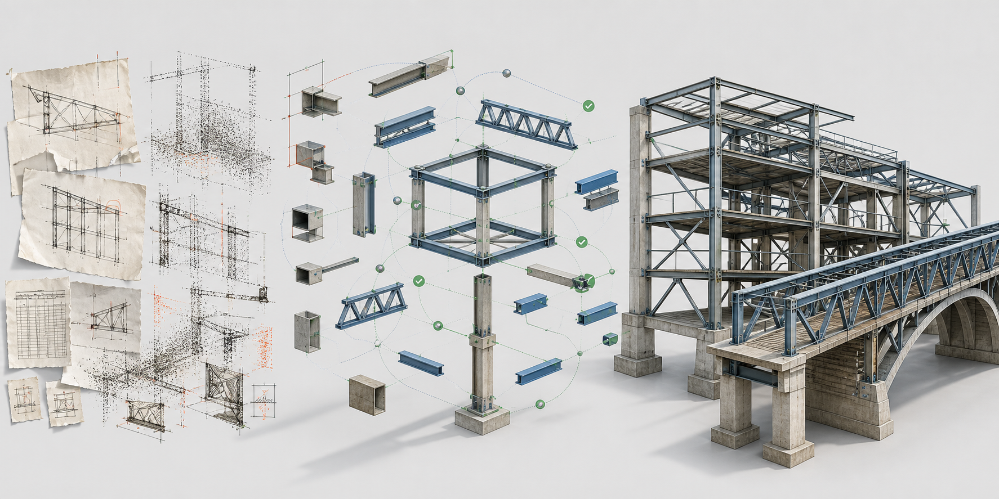

# NeuBE-Structural-Rebuild

**Neural Building Engine Structural Rebuild**

### Build Everything in 3D. Precisely.



[中文](#中文说明) | [English](#english)

> Fork this repository, teach it a structural domain, and publish traceable reconstruction results.
>
> **Built from the [NeuBE-Structural-Rebuild template](https://github.com/ConcentricCirclesMRTT/NeuBE-Structural-Rebuild).**

## 中文说明

桌上有一摞几十年前的工程图。没有三维模型，没有完整数据库，只有平面图、剖面、尺寸、材料表和工程师留下的符号。

AI 几秒钟就生成了一座漂亮的三维结构。问题是：**你敢拿它去施工、检修或改造吗？**

真正的问题不是模型够不够像，而是没人能回答：这根构件来自哪张图？这个尺寸是事实还是推测？哪些连接规则真的验证过？如果一个判断改变，哪些结果必须作废？

NeuBE-Structural-Rebuild 不让 AI 猜成品。它让 AI 像搭结构积木一样工作：先把散落的信息整理成证据块，再建立构件与连接，按照领域规则逐步拼装。缺少证据、违反约束或存在高后果歧义时，模型必须停下来等待复核。

通用 Skill 是底板，domain pack 是专业积木。建筑框架、桥梁、桁架和设备支撑可以换用不同套件，同时共享一套证据链、依赖关系和质量门禁。

### 只要你的行业有图纸，就值得拥有自己的 Domain Pack

结构图只是起点。建筑、桥梁、铁路、船舶、机械设备、工业管线、文物建筑、舞台装置乃至任何依靠图纸理解实体的行业，都有自己的符号、术语、连接方式和“老师傅一眼就知道不对”的判断。

这些知识不应该永远停留在个人经验里，也不应该被压缩成一句含糊的 Prompt。NeuBE 希望邀请各行各业的领域专家，把专业判断变成可以继承、测试和持续改进的 Domain Pack，再由其他人 Fork，构建面向本行业的 Skill、数据集、验证器、三维重构流程和审查工具。

你不需要先成为 AI 或软件专家。一次最小的共创可以从四样东西开始：

1. 一份完全脱敏、合成或明确允许再分发的典型图纸；
2. 一张行业术语、符号和构件关系表；
3. 几条“怎样算对、什么情况必须停下来复核”的专业规则；
4. 一个可由同行判断好坏的预期三维结果。

领域专家定义什么是真的，工具开发者把规则变成可执行工作流，审查者用新案例检验它是否可靠。一个新的领域衍生产品，就从这组三方可以共同检查的约定开始。

> **Bring the drawings. Teach the rules. Build the domain.**

> **重建结构，也重建结构背后的推理。**
>
> **Rebuild the structure. Rebuild the reasoning behind it.**

### 像搭积木一样教会 AI 一个结构领域

一盒积木之所以能搭出不同结构，不是因为每个模型都从零发明，而是因为它有稳定的连接方式、可替换的组件和明确的装配规则。NeuBE 采用同样的思路：

| 结构积木 | 在 Skill 中的含义 |
| --- | --- |
| 底板 | 来源、观察、假设、语义、约束、复核和输出的通用工作流 |
| 基础块 | 稳定 ID、证据引用、坐标系、状态和依赖关系 |
| Domain pack | 某类结构的构件本体、连接规则、容差、求解器和验证器 |
| 专业套件 | 建筑、桥梁、桁架或设备支撑等具体 Skill |
| 拼装说明 | 专家复核权限、质量门禁、成熟度和发布规则 |

这个类比不表示结构工程像玩具一样简单。恰恰相反，它强调复杂系统必须由可识别、可组合、可验证的模块构成。通用 Skill 负责约束拼装过程，domain pack 负责提供专业零件和规则，工程师负责不能由程序代替的决定。

### 核心思想

许多重构系统直接把图纸、照片或扫描数据转换成三维模型。这样的结果可能看起来合理，却隐藏着构件身份不确定、尺寸冲突、连接缺失或下游几何已经失效等问题。

本模板保留一条可审计的工作链：

```text
来源 Sources
  -> 观察 Observations
  -> 假设 Hypotheses
  -> 领域语义模型 Domain Semantic Model
  -> 确定性约束 Deterministic Constraints
  -> 人工复核 Human Review
  -> 版本化输出 Versioned Outputs
```

AI 负责提出有边界的解释候选；领域工具负责求解和验证确定性事实；人类专家负责那些具有工程责任的歧义决策。

### 领域型 Skill 的通用模板

本仓库将可复用行为与领域知识分开：

| 通用核心 | 领域扩展 |
| --- | --- |
| 证据来源和稳定 ID | 领域来源类型与提取规范 |
| 观察与解释分离 | 领域实体、属性和关系 |
| 假设与复核状态 | 领域歧义类型与复核问题 |
| 约束记录与残差 | 领域求解器、容差和工程规则 |
| 发布门禁与失效传播 | 领域成熟度标准和输出适配器 |
| 公开安全边界 | 经授权的标准、目录和项目策略 |

适合使用该模板的领域，应当能够由专业人员明确回答：

1. 什么可以作为证据；
2. 领域中存在哪些物理或概念实体；
3. 哪些约束和规则可以被程序验证；
4. 哪些未决问题必须阻止发布；
5. 不同输出成熟度分别意味着什么。

同一模式可以用于建筑框架、桥梁、桁架、设备支撑、工业装配体，也可以迁移到具有类似“证据到决策”流程的非结构专业领域。

### 方法从哪里来

这套方法最初形成于角钢塔重构任务。密集的多视图图纸、相似构件、重叠投影和严格连接关系让“生成一个看起来合理的模型”很容易，而“证明每根构件为什么在那里”很难。

这个压力测试帮助我们提炼出可复用的核心：证据与解释分离、稳定实体身份、领域约束、人工复核以及下游失效传播。公开仓库只保留这些通用方法，不包含真实项目数据或专有制造规则。

### 创建新的领域版本

Fork 本仓库后，Domain Builder 可以从模板直接创建一个专业领域和重构项目：

```bash
python3 scripts/init_domain.py steel-frame --title "Steel Frame"
python3 scripts/init_project.py demo-building \
  --domain steel-frame \
  --title "Demo Building"
python3 scripts/validate_workspace.py
```

还不确定怎样描述自己的领域？使用 [Domain Pack Proposal](https://github.com/ConcentricCirclesMRTT/NeuBE-Structural-Rebuild/issues/new?template=domain-pack-proposal.yml) 发起一个提案。先讲清图纸、术语、判断规则和预期输出，再与建模、AI 和软件贡献者共同落地。

随后完成四件事：

1. 在 `domains/steel-frame/` 定义领域本体、连接规则、容差、验证器和领域 Skill。
2. 在 `projects/demo-building/sources/index.json` 登记证据，在 `workspace/ir.json` 保存当前可追溯模型。
3. 把解析、求解或 CAD/BIM 工具生成的中间结果写入 `outputs/`，完成复核后把项目状态改为 `reviewed`。
4. 显式发布选定结果：

```bash
python3 scripts/publish_result.py demo-building \
  --artifact coordination-model.glb \
  --artifact review-report.json
```

发布工具会生成 `releases/demo-building/manifest.json`，记录模板来源、许可证、domain、成熟度、输入 IR 哈希、制品哈希和发布时间。未完成复核、违反 IR 门禁或位于 `outputs/` 之外的文件不能发布。

### 文件如何流动

```text
domains/<domain>/
  reusable Skill + ontology + rules + validators

projects/<project>/
  sources/       source register; raw evidence is ignored by Git
  workspace/     current IR and reproducible working state
  reviews/       expert decisions
  outputs/       generated intermediate results; ignored by Git

releases/<project>/
  manifest.json  immutable provenance and hashes
  artifacts/     explicitly selected publishable results
```

这套分层让同一个 domain pack 服务多个项目，同时避免把客户源文件、缓存和一次性中间制品误放进公开仓库。完整规则见 [`references/repository-layout.md`](references/repository-layout.md)。

不要把保密案例或私有规则目录复制到公开领域包。公开案例应当是完全合成或明确获得再分发授权的数据，并在保留推理难度的同时，避免让受保护的真实项目能够被反向恢复。

### 仓库内容

- [`SKILL.md`](SKILL.md)：Agent 工作流和行为契约；
- [`assets/public-ir.schema.json`](assets/public-ir.schema.json)：通用公开 IR Schema；
- [`assets/public-ir-template.json`](assets/public-ir-template.json)：空白项目模板；
- [`assets/synthetic-frame-example.json`](assets/synthetic-frame-example.json)：合成的跨来源框架案例；
- [`references/domain-profiles.md`](references/domain-profiles.md)：结构领域起始配置；
- [`references/reconstruction-method.md`](references/reconstruction-method.md)：关联、拓扑、求解和变更控制方法；
- [`references/public-safety-boundary.md`](references/public-safety-boundary.md)：公开发布和工程安全边界；
- [`references/repository-layout.md`](references/repository-layout.md)：目录职责和文件生命周期；
- [`template.json`](template.json)：机器可读的模板身份、标语、来源与许可证；
- [`LICENSE`](LICENSE) 与 [`NOTICE`](NOTICE)：Apache-2.0 授权和需要保留的来源声明；
- [`CITATION.cff`](CITATION.cff)：论文、报告和公开 domain pack 的引用信息；
- [`CONTRIBUTING.md`](CONTRIBUTING.md)：安全贡献领域包和通用能力的规则；
- [`domains/_template/`](domains/_template/)：domain pack 模板；
- [`projects/_template/`](projects/_template/)：重构项目模板；
- [`scripts/init_domain.py`](scripts/init_domain.py) 与 [`scripts/init_project.py`](scripts/init_project.py)：初始化工具；
- [`scripts/validate_workspace.py`](scripts/validate_workspace.py)：仓库和项目验证器；
- [`scripts/publish_result.py`](scripts/publish_result.py)：带哈希的结果发布工具；
- [`scripts/self_test.py`](scripts/self_test.py)：隔离环境中的完整生命周期测试；
- [`.github/workflows/validate.yml`](.github/workflows/validate.yml)：每次 Push 和 Pull Request 的自动门禁。

### 验证示例

```bash
python3 scripts/validate_public_ir.py assets/synthetic-frame-example.json
```

预期结果：

```text
OK: assets/synthetic-frame-example.json is a valid public structure reconstruction IR
```

### Fork、署名与许可证

本仓库使用 [Apache License 2.0](LICENSE)。你可以 Fork、修改、商用和发布自己的 domain pack 或重构系统，但分发时必须遵守许可证并保留 [`NOTICE`](NOTICE) 中适用的声明。Apache-2.0 同时提供明确的贡献者专利授权，适合作为长期演进的工程基础仓库。

通过 GitHub 的 **Use this template** 创建仓库后，建议把下面这行保留在 README 首屏：

```markdown
Built from the [NeuBE-Structural-Rebuild template](https://github.com/ConcentricCirclesMRTT/NeuBE-Structural-Rebuild).
```

初始化脚本会把同一来源写入 domain 和 project manifest，发布工具继续把它写入 release manifest。这样即使仓库被下载、迁移或制品脱离 GitHub 页面，仍然可以知道它从哪个方法模板构建。项目自己的代码、领域规则、数据和输出可以另行声明许可证，但不得删除上游仍然适用的 Apache-2.0 与 NOTICE 信息。

### 能力边界

本公开仓库支持概念级和协调级重构。几何一致不代表结构承载能力、安全性、规范符合性、详图完整性或制造就绪。用于重要工程决策时，必须引入经授权的领域规则、独立验证以及具备相应资质的工程复核。

---

## English

On the table is a stack of engineering drawings from decades ago. There is no 3D model and no complete database, only plans, sections, dimensions, schedules, and symbols left by engineers.

An AI produces a beautiful 3D structure in seconds. The question is: **would you trust it for construction, inspection, or modification?**

The real problem is not whether the model looks right. It is whether anyone can answer: Which drawing supports this member? Is this dimension observed or inferred? Which connection rules were actually checked? If one decision changes, which outputs must be invalidated?

NeuBE-Structural-Rebuild does not ask the AI to guess the finished model. It makes the agent work as if assembling structural building blocks: organize scattered information into evidence blocks, establish elements and connections, and assemble them under domain rules. When evidence is missing, a constraint fails, or an ambiguity carries real consequences, the model must stop for review.

The general skill is the baseplate; domain packs provide the professional pieces. Building frames, bridges, trusses, and equipment supports can use different kits while sharing one evidence chain, dependency model, and set of quality gates.

### If your field has drawings, it deserves a domain pack

Structural drawings are only the beginning. Architecture, bridges, railways, shipbuilding, machinery, industrial piping, heritage conservation, stage systems, and every profession that reads drawings to understand physical things has its own symbols, vocabulary, interfaces, and expert sense of what cannot be right.

That knowledge should not remain trapped in individual experience or be compressed into a vague prompt. NeuBE invites domain experts to turn professional judgment into Domain Packs that can be inherited, tested, and improved. Others can then fork them into industry-specific skills, datasets, validators, 3D reconstruction pipelines, and review tools.

You do not need to become an AI or software expert first. A minimum useful collaboration starts with four things:

1. one fully sanitized, synthetic, or explicitly redistributable representative drawing;
2. a glossary of domain symbols, terms, elements, and relationships;
3. a few rules that define what is correct and what must stop for review;
4. an expected 3D result that a peer can evaluate.

Domain experts define what is true. Tool builders turn those rules into executable workflows. Reviewers challenge the result with new cases. A domain-specific product begins with an agreement all three can inspect.

> **Bring the drawings. Teach the rules. Build the domain.**

> **Rebuild the structure. Rebuild the reasoning behind it.**

### Teaching a structural domain through modular building blocks

A modular construction kit can produce different structures because it provides stable interfaces, interchangeable components, and explicit assembly rules. NeuBE follows the same pattern:

| Building block | Meaning in the skill |
| --- | --- |
| Baseplate | The shared source, observation, hypothesis, semantics, constraint, review, and output workflow |
| Basic blocks | Stable IDs, evidence references, coordinate frames, states, and dependencies |
| Domain pack | A structure family's ontology, connection rules, tolerances, solvers, and validators |
| Specialized kit | A building, bridge, truss, or equipment-support skill |
| Assembly guide | Review authority, quality gates, maturity levels, and release rules |

The analogy does not mean structural engineering is as simple as a toy. It means that complex systems need identifiable, composable, and testable parts. The generic skill governs how parts may be assembled, a domain pack supplies professional components and rules, and engineers retain decisions that cannot be delegated to software.

## The core idea

Many reconstruction systems jump directly from a drawing, image, or scan to a 3D model. That result may look plausible while hiding uncertain identities, conflicting dimensions, missing connections, or stale downstream geometry.

This template preserves an auditable chain:

```text
Sources
  -> Observations
  -> Hypotheses
  -> Domain Semantic Model
  -> Deterministic Constraints
  -> Human Review
  -> Versioned Outputs
```

The AI proposes bounded interpretations. Domain tools solve and validate deterministic facts. Human experts decide the ambiguities that carry engineering responsibility.

## A template for domain skills

The repository separates reusable behavior from domain knowledge.

| Reusable core | Domain-specific extension |
| --- | --- |
| Evidence provenance and stable IDs | Domain source types and extraction conventions |
| Observation versus interpretation | Domain entities, attributes, and relationships |
| Hypothesis and review states | Domain ambiguity patterns and review questions |
| Constraint records and residuals | Domain solvers, tolerances, and engineering rules |
| Release gates and stale propagation | Domain maturity criteria and output adapters |
| Public safety boundary | Authorized standards, catalogs, and project policy |

A suitable domain is one where practitioners can define:

1. what counts as evidence;
2. which physical or conceptual entities exist;
3. which constraints and rules can be tested;
4. which unresolved decisions must block release;
5. what output maturity means.

The same pattern can support building frames, bridges, trusses, equipment supports, industrial assemblies, or non-structural professional domains with an equivalent evidence-to-decision workflow.

## Where the method came from

This method grew out of an angle-tower reconstruction task. Dense multi-view drawings, similar members, overlapping projections, and strict connection relationships make it easy to generate a plausible model and difficult to prove why every member belongs where it does.

That stress test helped us extract the reusable core: separation of evidence and interpretation, stable entity identity, domain constraints, human review, and downstream invalidation. This public repository contains those general methods, not real project data or proprietary fabrication rules.

## Create a domain-specific version

After forking this repository, a Domain Builder can create a specialization and a reconstruction project directly from the templates:

```bash
python3 scripts/init_domain.py steel-frame --title "Steel Frame"
python3 scripts/init_project.py demo-building \
  --domain steel-frame \
  --title "Demo Building"
python3 scripts/validate_workspace.py
```

Not sure how to describe your field yet? Open a [Domain Pack Proposal](https://github.com/ConcentricCirclesMRTT/NeuBE-Structural-Rebuild/issues/new?template=domain-pack-proposal.yml). Start with the drawings, vocabulary, judgment rules, and expected output, then build it with modeling, AI, and software contributors.

Then complete four steps:

1. Define ontology, connection rules, tolerances, validators, and the domain Skill under `domains/steel-frame/`.
2. Register evidence in `projects/demo-building/sources/index.json` and keep the traceable current model in `workspace/ir.json`.
3. Write parser, solver, or CAD/BIM outputs to `outputs/`; after review, change project status to `reviewed`.
4. Publish only selected results:

```bash
python3 scripts/publish_result.py demo-building \
  --artifact coordination-model.glb \
  --artifact review-report.json
```

The publisher creates `releases/demo-building/manifest.json` with the template origin, license, domain, maturity, input IR hash, artifact hashes, and publication time. It rejects unreviewed projects, invalid IR state, and files outside the project's output directory.

## How files move

```text
domains/<domain>/
  reusable Skill + ontology + rules + validators

projects/<project>/
  sources/       source register; raw evidence is ignored by Git
  workspace/     current IR and reproducible working state
  reviews/       expert decisions
  outputs/       generated intermediate results; ignored by Git

releases/<project>/
  manifest.json  immutable provenance and hashes
  artifacts/     explicitly selected publishable results
```

This separation lets one domain pack serve many projects without mixing customer evidence, caches, and one-off intermediate files into a public repository. See [`references/repository-layout.md`](references/repository-layout.md) for the complete policy.

Do not copy confidential examples or private rule catalogs into a public specialization. A public example should be synthetic or explicitly redistributable and should preserve the reasoning challenge without allowing a protected project to be reconstructed.

## Repository contents

- [`SKILL.md`](SKILL.md): agent workflow and behavioral contract;
- [`assets/public-ir.schema.json`](assets/public-ir.schema.json): public generic IR schema;
- [`assets/public-ir-template.json`](assets/public-ir-template.json): empty project template;
- [`assets/synthetic-frame-example.json`](assets/synthetic-frame-example.json): synthetic cross-source example;
- [`references/domain-profiles.md`](references/domain-profiles.md): starter structural profiles;
- [`references/reconstruction-method.md`](references/reconstruction-method.md): association, topology, solving, and change-control method;
- [`references/public-safety-boundary.md`](references/public-safety-boundary.md): publication and engineering safety limits;
- [`references/repository-layout.md`](references/repository-layout.md): directory ownership and file lifecycle;
- [`template.json`](template.json): machine-readable template identity, tagline, origin, and license;
- [`LICENSE`](LICENSE) and [`NOTICE`](NOTICE): Apache-2.0 terms and retained origin notice;
- [`CITATION.cff`](CITATION.cff): citation metadata for papers, reports, and public domain packs;
- [`CONTRIBUTING.md`](CONTRIBUTING.md): rules for contributing domain packs and reusable capabilities safely;
- [`domains/_template/`](domains/_template/): domain-pack template;
- [`projects/_template/`](projects/_template/): reconstruction-project template;
- [`scripts/init_domain.py`](scripts/init_domain.py) and [`scripts/init_project.py`](scripts/init_project.py): initialization tools;
- [`scripts/validate_workspace.py`](scripts/validate_workspace.py): repository and project validator;
- [`scripts/publish_result.py`](scripts/publish_result.py): hash-based result publisher;
- [`scripts/self_test.py`](scripts/self_test.py): isolated end-to-end lifecycle test;
- [`.github/workflows/validate.yml`](.github/workflows/validate.yml): automatic gates for every push and pull request.

## Validate the example

```bash
python3 scripts/validate_public_ir.py assets/synthetic-frame-example.json
```

Expected result:

```text
OK: assets/synthetic-frame-example.json is a valid public structure reconstruction IR
```

## Forking, attribution, and license

This repository is licensed under the [Apache License 2.0](LICENSE). You may fork, modify, use commercially, and distribute your own domain pack or reconstruction system, provided that redistribution follows the license and retains the applicable notices from [`NOTICE`](NOTICE). Apache-2.0 also includes an explicit contributor patent grant, making it suitable for a long-lived engineering foundation.

After creating a repository with GitHub's **Use this template**, keep this line visible near the top of your README:

```markdown
Built from the [NeuBE-Structural-Rebuild template](https://github.com/ConcentricCirclesMRTT/NeuBE-Structural-Rebuild).
```

The initialization scripts carry the same origin into domain and project manifests, and the publisher carries it into every release manifest. Provenance therefore survives downloads, repository moves, and detached artifacts. A derived project may license its own code, domain rules, data, and outputs separately, but it must not remove upstream Apache-2.0 and NOTICE information where those terms still apply.

## Scope

This public repository supports concept- and coordination-grade reconstruction. Geometric consistency does not establish structural capacity, safety, regulatory compliance, detailing completeness, or fabrication readiness. Consequential use requires authorized domain rules, independent validation, and appropriately qualified engineering review.
